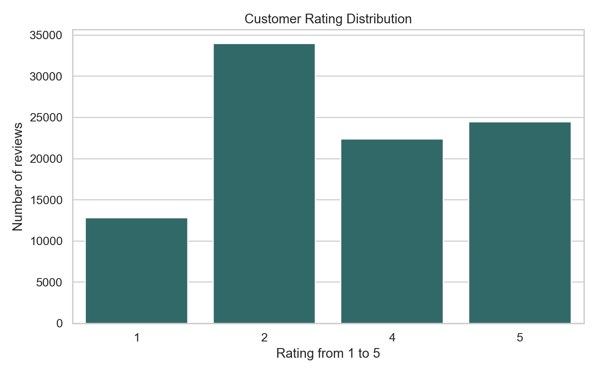
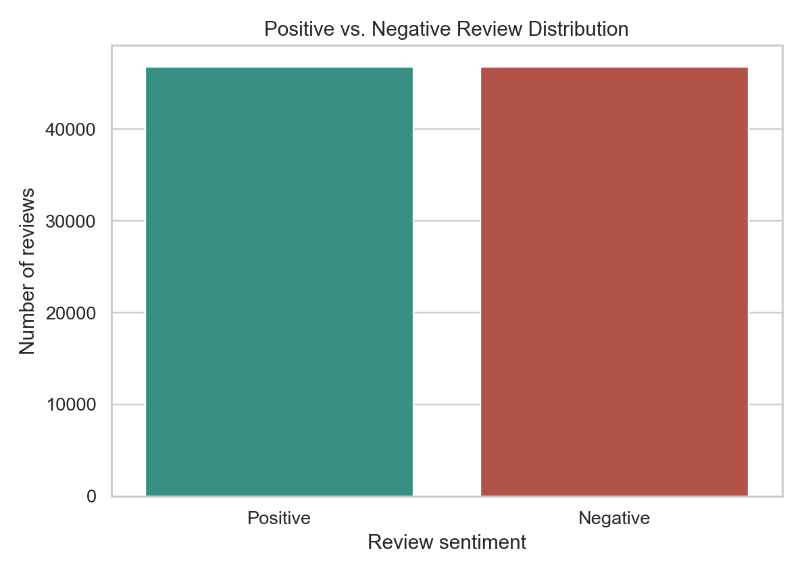
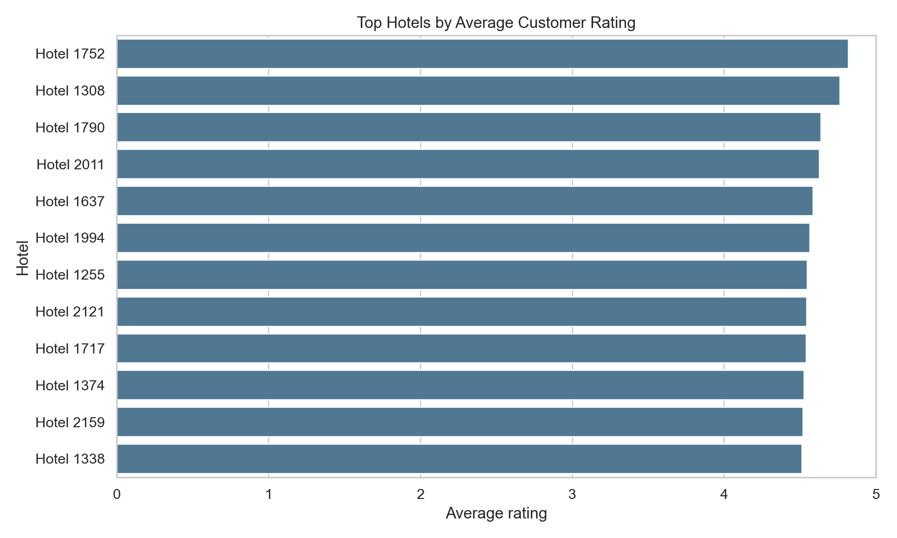
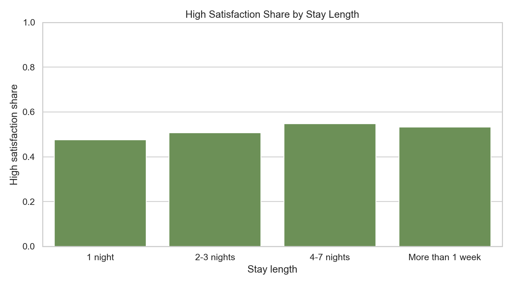
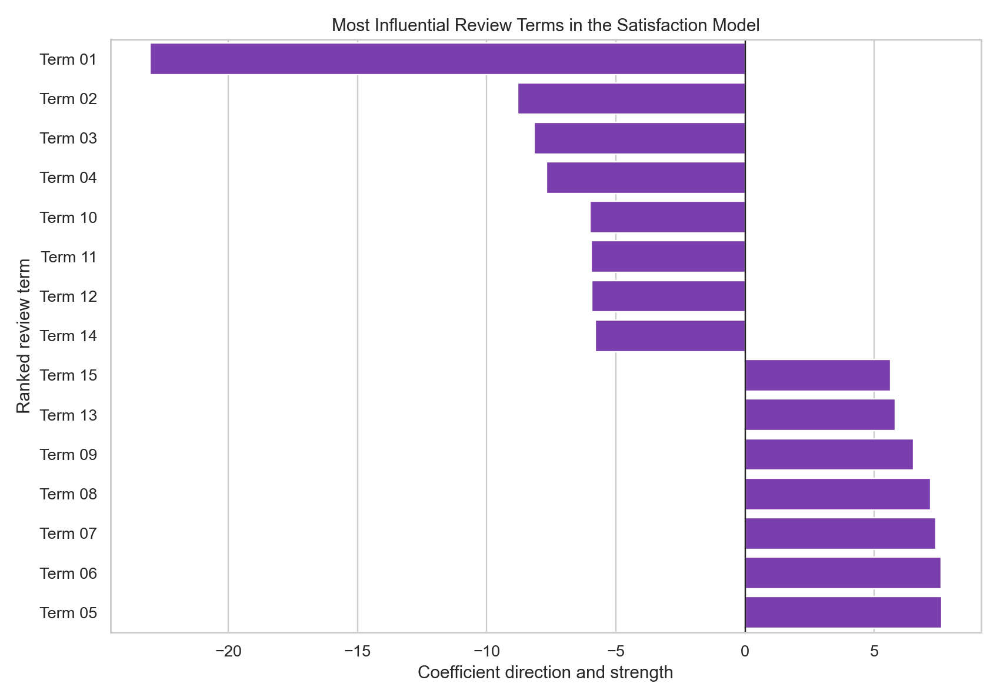

# تحليل رضا عملاء الفنادق العربية باستخدام تعلم الآلة

## Project Overview

This portfolio case study analyzes Arabic hotel customer reviews and builds a machine learning workflow to classify customer satisfaction from review text. The project is designed as a client-facing analytics sample for hospitality, travel, and customer experience teams that need to understand Arabic feedback at scale.

The work uses a public Arabic hotel reviews dataset and presents the final outputs as a clean business case study: customer satisfaction analysis, visual summaries, model performance, and practical insights.

## Business Questions

- What is the overall distribution of customer ratings?
- What share of reviews indicates high satisfaction?
- Which hotel groups show stronger average satisfaction?
- Does satisfaction differ by stay length?
- Can Arabic review text predict high or low satisfaction?
- Which Arabic terms are most influential in the prediction model?

## Dataset

The project uses the HARD Arabic Hotel Reviews Dataset, a public dataset of Arabic hotel reviews originally associated with Booking.com review data.

More details are available in [data_sources.md](data_sources.md).

## Methodology

The private implementation includes data cleaning, Arabic text preparation, exploratory analysis, feature extraction, and a supervised machine learning model for satisfaction classification.

The public portfolio version keeps only the presentation outputs. Raw data, trained model files, and reusable training scripts are intentionally excluded.

## Key Results

- Reviews after cleaning: 93,631
- Hotels covered: 976
- Average rating: 3.12 out of 5
- High satisfaction share: 50.01%
- Model accuracy: 88.99%
- ROC AUC: 95.25%

## Visual Outputs

### Rating Distribution



### Sentiment Distribution



### Top Hotels by Average Rating



### Satisfaction by Stay Length



### Most Influential Terms



## Portfolio Contents

```text
notebooks/
  arabic_hotel_satisfaction_case_study_summary.ipynb

reports/
  executive_report_ar.md
  executive_report_en.md
  figures/
  tables/

data_sources.md
```

## Important Note

This repository is a portfolio presentation version. It demonstrates the analytical approach and final outputs without publishing raw review data, trained model artifacts, or reusable production code.
